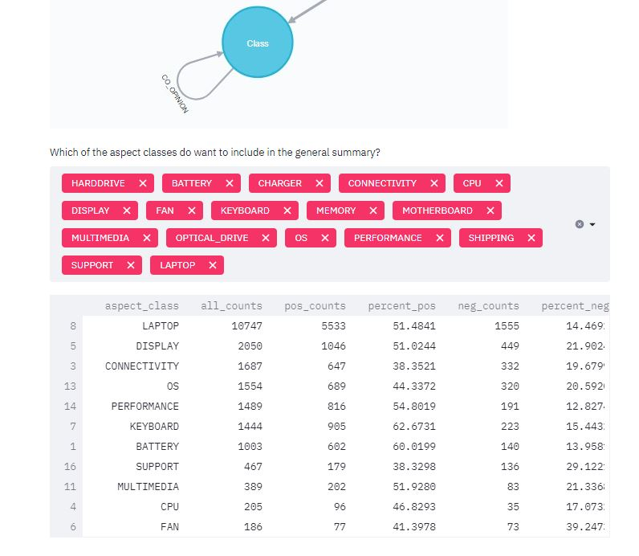

# Streamlit_GBCFA
Streamlit + Neo4J for Graph based customer feedback analysis

 

Below of the general sentiment break down extracted from the graph.

# Co-mention Analysis

# Full-text search based analysis

